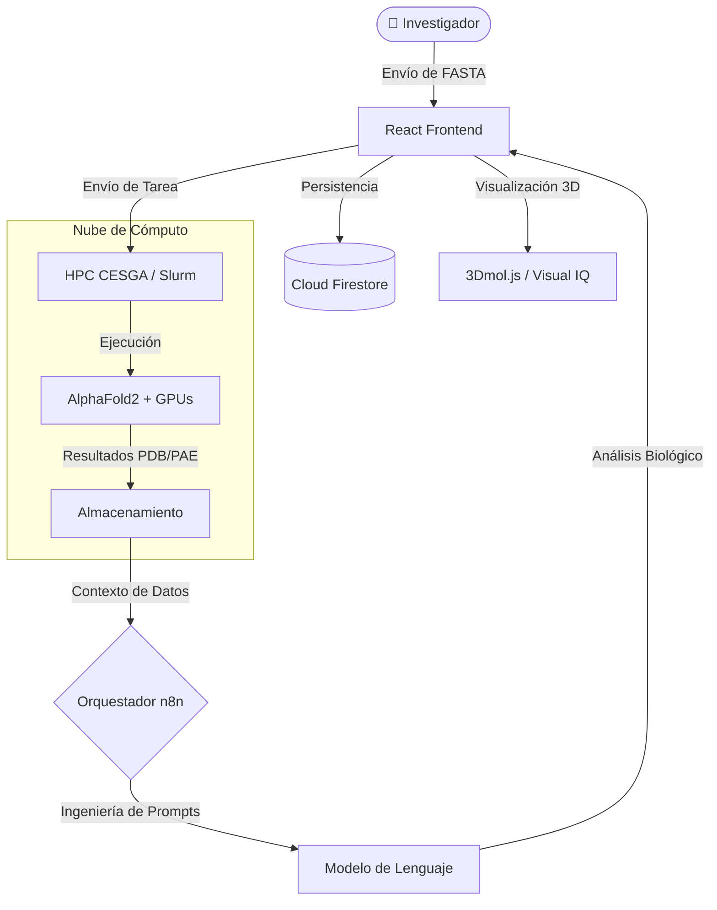

#  Micafold

[](https://github.com/JoseEstevez520/Impacthon_investigacion)
[](https://github.com/JoseEstevez520/Impacthon_investigacion)
[](https://www.cesga.es/)
[](https://github.com/JoseEstevez520/Impacthon_investigacion)

**Micafold** cierra la brecha entre la computación de alto rendimiento y la intuición biológica. Desarrollada durante la **Impacthon 2026**, es una plataforma aumentada con IA diseñada para que los investigadores puedan plegar, visualizar e interpretar estructuras de proteínas utilizando la potencia de la infraestructura del CESGA.

---

## 🌟 La Visión: Personalización sin Frustración

La biología estructural suele estar frenada por flujos de trabajo basados en terminales y métricas crípticas. **Micafold** transforma esta experiencia en un viaje visual e intuitivo.

> [!TIP]
> **Nuestra apuesta**: La personalización total de la experiencia del usuario. Eliminamos la barrera de entrada técnica, ahorrando iteraciones innecesarias, tiempo y sobre todo la **frustración** habitual en el proceso de investigación bioinformática.

Este proyecto democratiza el acceso a herramientas de vanguardia como **AlphaFold2**, permitiendo que los investigadores se centren en lo que realmente importa: el descubrimiento científico.

---

## 🏗️ Arquitectura Técnica

Micafold utiliza una arquitectura desacoplada para garantizar escalabilidad y seguridad en entornos de supercomputación.



---

## 🚀 Funcionalidades Principales

### 🤖 ProteIA: Asistente de Investigación con IA
Integrado en todo el flujo de trabajo para traducir datos en conocimiento biológico:
- **Informes Inteligentes**: Genera automáticamente resúmenes científicos a partir de los resultados del plegamiento.
- **Chat Contextual**: Pregunta a ProteIA sobre regiones específicas, mutaciones o implicaciones biológicas.
- **Diagnóstico de Errores**: Traduce errores complejos de HPC/Slurm en consejos biológicos accionables.

### 🔬 Inteligencia Visual Científica
- **Visor 3D Interactivo**: Renderizado de alta definición para estructuras PDB/mmCIF.
- **Interpretación de Métricas**: Mapeo visual de pLDDT (confianza) y mapas de calor PAE traducidos a lenguaje natural.
- **Exportación Rápida**: Descarga de informes listos para publicación y archivos estructurales.

### ⚡ Nativo para HPC vía CESGA
Integración directa con la infraestructura del **CESGA (Centro de Supercomputación de Galicia)**:
- **Monitorización en Tiempo Real**: Seguimiento de estados (PENDING → RUNNING → COMPLETED) sin necesidad de SSH.
- **Metadatos Enriquecidos**: Obtención automática de datos de UniProt, información de organismos y métricas experimentales.

---

## 🛠️ Stack Tecnológico

| Capa | Tecnologías |
| :--- | :--- |
| **Frontend** | React 19, Vite, Tailwind CSS, Framer Motion |
| **Visualización** | 3Dmol.js, Plotly.js (Heatmaps PAE) |
| **Orquestación IA** | n8n (Flujos Agentic), LLMs especializados |
| **Infraestructura** | CESGA HPC (AlphaFold2, Slurm), Firebase Firestore |

---

## 📂 Estructura del Repositorio

Para mantener el proyecto organizado, el repositorio se estructura de la siguiente manera:

*   **`frontend/`**: Todo el código fuente de la aplicación cliente (React + Vite).
*   **`docs/`**: Base de conocimientos completa del proyecto, incluyendo:
    *   `investigacion/`: Análisis de mercado, usuarios y retos técnicos.
    *   `presentacion/`: Materiales del pitch y estrategia de negocio.
    *   `Documentacion/`: Guías de API y manuales técnicos.
*   **Archivos de Configuración**: Firebase, Git y dependencias en la raíz.

---

## 🚦 Primeros Pasos

### Instalación
1. **Clonar el repositorio**:
   ```bash
   git clone https://github.com/JoseEstevez520/Impacthon_investigacion.git
   ```
2. **Configurar el Frontend**:
   ```bash
   cd frontend
   npm install
   ```
3. **Ejecutar en desarrollo**:
   ```bash
   npm run dev
   ```

---

## 👥 Equipo
Desarrollado con ❤️ por el **Micafold Team** durante la **Impacthon 2026** en el CESGA.

---

## 📄 Notas Finales
Este repositorio contiene tanto el código fuente como la documentación de investigación completa de la plataforma Micafold. El proyecto se mantiene como una prueba de concepto (PoC) del futuro de la biología estructural accesible en entornos de computación de alto rendimiento.
