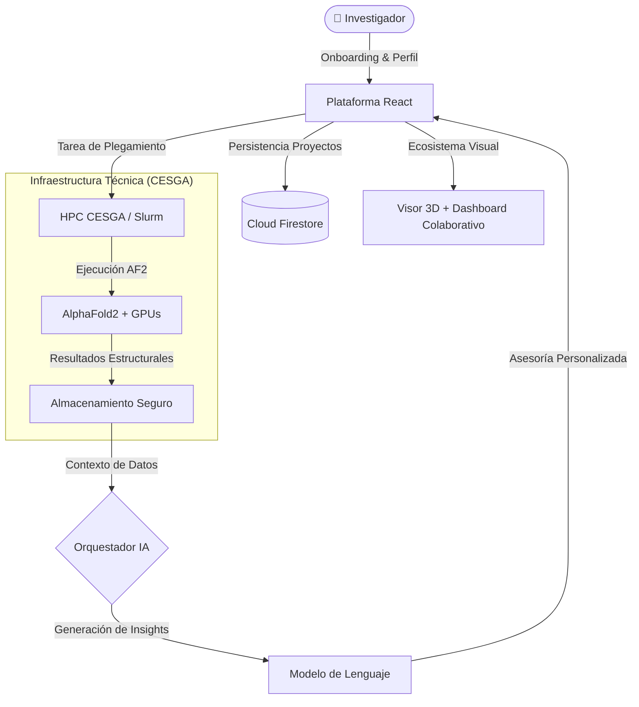

#  Micafold — Por el Equipo Teis

**Micafold** no es solo una herramienta, es el centro de trabajo digital para el biólogo del futuro. Desarrollada por el **Equipo Teis** para la **Cátedra CAMELIA (Medicina Personalizada)** durante la **Impacthon 2026**, esta plataforma aprovecha la potencia de la infraestructura del CESGA para transformar datos complejos en descubrimientos científicos accionables.

---

## 🌟 La Visión del Equipo Teis: Un Ecosistema, no una Herramienta

Nuestra filosofía se basa en que la tecnología debe adaptarse al científico, y no al revés. En **Micafold**, la apuesta por la **personalización radical** comienza desde el primer contacto.

### 🧬 Personalización Inteligente (Onboarding)
A través de un proceso de onboarding diseñado para captar el perfil y las necesidades específicas del investigador, la plataforma se reconfigura para ahorrar iteraciones críticas y eliminar la frustración técnica. No entregamos una interfaz genérica; entregamos un espacio de trabajo a medida.

### 🏢 Más que un Visor 3D: Una Plataforma Integral
Micafold ha sido diseñado como un entorno completo para la investigación dentro del ecosistema de **CAMELIA**:
*   **Organización**: Espacios de trabajo dedicados para gestionar múltiples proyectos de plegamiento.
*   **Colaboración**: Herramientas integradas para compartir resultados y hallazgos con la comunidad científica.
*   **Aprendizaje**: Recursos educativos dinámicos para investigadores que evolucionan con la IA.

---

## 🏗️ Arquitectura Técnica

Micafold utiliza una arquitectura desacoplada diseñada para integrarse con sistemas de supercomputación de alto rendimiento.

---

## 🚀 Funcionalidades Principales

### 🤖 ProteIA: Asistente de Investigación con IA
Integrado en todo el flujo de trabajo para traducir datos en conocimiento biológico:
- **Informes a Medida**: Genera automáticamente resúmenes científicos adaptados al nivel de especialización del usuario.
- **Chat Contextual**: Pregunta sobre regiones específicas, mutaciones o aplicaciones terapéuticas.
- **Diagnóstico Humano**: Traduce errores complejos de infraestructura en consejos prácticos para el biólogo.

### 🔬 Inteligencia Visual y Colaborativa
- **Visor 3D Interactivo**: Renderizado de alta definición integrado en el flujo de trabajo diario.
- **Interpretación de Métricas**: Mapeo visual de confianza y matrices PAE explicadas en lenguaje natural.
- **Centro de Exportación**: Descarga informes y estructuras optimizados para publicaciones científicas.

---

## 🛠️ Stack Tecnológico

| Capa | Tecnologías |
| :--- | :--- |
| **Plataforma** | React 19, Vite, Tailwind CSS, Framer Motion |
| **Visualización** | 3Dmol.js, Plotly.js |
| **Inteligencia** | n8n (Flujos Agentic), LLMs |
| **Infraestructura** | CESGA HPC (Finis Terrae III), Slurm, Firebase Firestore |

---

## 📂 Estructura del Repositorio

*   **`frontend/`**: Todo el código fuente de la plataforma cliente.
*   **`docs/`**: Base de conocimientos completa del proyecto (Investigación para Camelia, Pitch y Guías).
*   **Raíz**: Configuraciones de despliegue y dependencias globales.

---

## 🚦 Primeros Pasos

1. **Clonar**: `git clone https://github.com/JoseEstevez520/Impacthon_investigacion.git`
2. **Setup**: `cd frontend && npm install`
3. **Despegue**: `npm run dev`

---

## 👥 Equipo
Desarrollado con ❤️ por el **Equipo Teis** durante la **Impacthon 2026** para la **Cátedra CAMELIA**.
